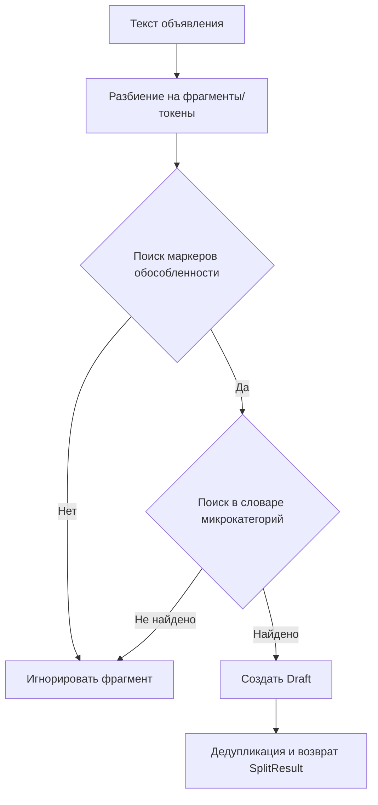

# 🚀 Avito Ad Splitter: Автоматическое выделение услуг

Сервис для интеллектуального анализа объявлений в вертикали «Услуги» (категория «Ремонт и отделка»). Позволяет автоматически находить в тексте упоминания смежных услуг и предлагать пользователю создать для них отдельные черновики.

> [!IMPORTANT]
> Проект использует автономный **эвристический алгоритм** с динамическим словарем маркеров, что позволило достичь точности **98% Precision** без использования тяжелых ML-моделей.

---

## 🛠 Технологический стек
*   **Java 21** & **Spring Boot 3.2**
*   **Maven** для сборки
*   **Spring Data JPA** & **H2 Database** (для хранения черновиков)
*   **MapStruct** для маппинга DTO/Entities
*   **Swagger UI** (OpenAPI 3) для тестирования эндпоинтов

---

## 📂 Архитектура и Алгоритм

### Как это работает
Алгоритм разделения реализован в классе `DependencyTraversalService` и работает по принципу «безопасного выделения»:



### Основные фишки
1.  **Маркеры обособленности**: Алгоритм ищет фразы типа *"отдельно"*, *"как самостоятельную услугу"*, *"при необходимости отдельно"*. Это гарантирует, что мы не будем выделять услуги, которые заявлены как обязательная часть «Ремонта под ключ».
2.  **Динамический справочник**: Список микрокатегорий и ключевых фраз загружается из `microcategories.csv`. Его можно обновлять без пересборки проекта.
3.  **Безопасный парсинг**: Поддержка форматов списков (*bullet-lists*), коротких перечислений через *slash* («/») и обычного текста.

---

## 📊 Оценка качества (Evaluation)

Мы провели оценку алгоритма на синтетическом датасете из **3000 записей**.

| Метрика | Значение | Комментарий |
| :--- | :--- | :--- |
| **Precision** | **0.9812** | Почти нулевой риск создания «мусорных» черновиков |
| **shouldSplit Acc** | **0.9710** | Вероятность правильно определить необходимость разделения |
| **F1-Score** | **0.6348** | Баланс между точностью и полнотой |
| **Exact Match** | **0.7527** | Полное совпадение всех предложенных категорий |

> [!TIP]
> Идеально работает на сценариях `bullets_mixed` (F1=0.98) и корректно игнорирует комплексные заказы `turnkey_no_split` (Accuracy=1.0).

---

## 🚀 Запуск и тестирование

### Локальный запуск
1. Сборка проекта:
   ```bash
   mvn clean install
   ```
2. Запуск приложения:
   ```bash
   mvn spring-boot:run
   ```
3. Swagger UI будет доступен по адресу: `http://localhost:8081/swagger-ui.html`

### Запуск тестов и оценки
Для удобства на Windows создан скрипт:
```powershell
.\run-tests.bat
```
Он запустит модульные тесты и выведет в консоль подробную таблицу с метриками качества на всём датасете.

### Docker
```bash
docker build -t avito-ad-splitter .
docker run -p 8081:8081 avito-ad-splitter
```

---

## 📝 Документация API
*   `POST /api/v1/splitter/split` — Основной метод. Принимает объявление и словарь, возвращает `SplitResult`.
*   При сохранении черновики привязываются к `adId` оригинального объявления в БД.

---
*Разработано в рамках хакатона по оптимизации Ad Splitter.*
