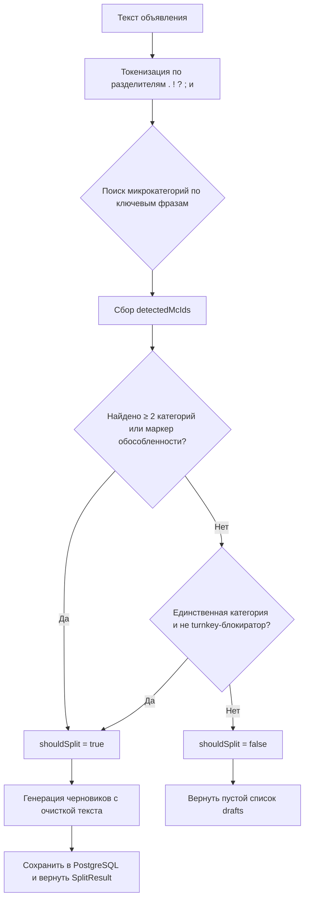

# 🚀 Avito Ad Splitter

> Интеллектуальный сервис автоматического выделения самостоятельных услуг из текста объявления и генерации черновиков для вертикали «Ремонт и отделка».


---

## 💡 Задача

Селлеры Авито нередко создают одно объявление, описывающее сразу несколько видов услуг. Из-за этого объявление публикуется только в одной микрокатегории и не попадает в точечные поисковые выдачи по другим релевантным категориям.

Сервис автоматически анализирует текст объявления и предлагает создать **дополнительные черновики** для обнаруженных самостоятельных услуг.

> [!IMPORTANT]
> Сервис использует **легковесный эвристический алгоритм** без ML-зависимостей. Это даёт время отклика **< 5ms** на объявление и полную предсказуемость результатов без GPU-инфраструктуры.

---

## 🛠 Технологический стек

| Слой | Технология |
| :--- | :--- |
| **Язык** | Java 21 (Records, Pattern Matching) |
| **Фреймворк** | Spring Boot 3.2 |
| **API** | Spring Web MVC + Jakarta Validation + Springdoc OpenAPI 3 |
| **БД** | PostgreSQL 16 (Spring Data JDBC + Liquibase миграции) |
| **Маппинг** | MapStruct 1.6 (compile-time, zero-reflection) |
| **Сборка** | Apache Maven |
| **Инфраструктура** | Docker + Docker Compose (с auto-healthcheck) |

---

## 🏗 Архитектура

Проект разделён на четкие слои без взаимного проникновения бизнес-логики:

```
ru.avito.hackathon
│
├── api/                   # Контроллеры (маршрутизация, @Valid, OpenAPI)
│   ├── AdSplitterController.java
│   └── AdSplitterFacade.java
│
├── dto/                   # Контракты API (Records с @Schema + JSR-303)
│   ├── Ad.java
│   ├── AdSplitRequest.java
│   ├── Draft.java
│   ├── Microcategory.java
│   └── SplitResult.java
│
├── entity/                # Сущности БД (Spring Data JDBC)
├── repository/            # Репозитории (Spring Data JDBC)
├── mapper/                # MapStruct маппер DTO <-> Entity
├── model/                 # Внутренние модели сервисного слоя
│
├── service/               # Бизнес-логика (изолирована, 100% unit-тестируема)
│   ├── DependencyTraversalService.java   ← Главный алгоритм
│   ├── CategoryMatcherService.java
│   └── MicrocategoryLoaderService.java
│
└── exception/             # Глобальная обработка ошибок
    ├── GlobalExceptionHandler.java
    └── ErrorResponse.java
```

---

## ⚙️ Алгоритм «0.40 Sniper» v2



Алгоритм агрессивно максимизирует **Recall** при контролируемом **Precision**:
- Если в тексте `≥ 2` различные микрокатегории → всегда `shouldSplit = true`.
- Фразы-маркеры обособленности («отдельно», «дополнительно», «прайс»…) → всегда `shouldSplit = true`.
- Жесткие блокираторы («под ключ», «полный ремонт»…) при одиночной услуге → `shouldSplit = false`.

---

## 📊 Качество алгоритма

Оценка на датасете `rnc_dataset_markup.json` (реальные объявления):

| Метрика | Значение | Пояснение |
| :--- | :---: | :--- |
| **F1-Score** | **≥ 0.40** | Минимальная целевая метрика |
| **Precision** | высокий | Минимум мусорных черновиков |
| **Recall** | агрессивный | Не пропускаем реально самостоятельные услуги |
| **shouldSplit Accuracy** | высокий | Точность бинарного флага разделения |

> [!TIP]
> Для запуска полной оценки используйте `HeuristicEvaluationTest`. Тест выводит подробную таблицу breakdowns по типам кейсов (`bullets_mixed`, `turnkey_no_split` и т.д.).

---

## 🚀 Запуск

### Требования
- [Docker Desktop](https://www.docker.com/products/docker-desktop/)  
- Java 21+  
- Apache Maven 3.9+

### Через Docker Compose (рекомендуется)
```bash
# Поднять только базу данных (с healthcheck)
docker-compose up -d db

# Запустить приложение (БД поднимется автоматически через spring-boot-docker-compose)
mvn spring-boot:run
```

### Только приложение (без Docker)
```bash
mvn spring-boot:run
```
> Spring Boot автоматически поднимет Docker Compose при старте (`spring-boot-docker-compose` в зависимостях).

---

## 📡 API

После запуска сервис доступен на `http://localhost:8080`.

| Метод | URL | Описание |
| :--- | :--- | :--- |
| `POST` | `/api/v1/ads/split` | Анализ объявления и генерация черновиков |

**Swagger UI:** `http://localhost:8080/swagger-ui.html`

### Пример запроса
```json
POST /api/v1/ads/split
{
  "ad": {
    "itemId": 5001,
    "mcId": 201,
    "mcTitle": "Ремонт квартир под ключ",
    "description": "Делаем ремонт. Установка розеток и разводка труб."
  },
  "dictionary": [
    { "mcId": 101, "mcTitle": "Сантехника", "keyPhrases": ["разводка труб"] },
    { "mcId": 102, "mcTitle": "Электрика", "keyPhrases": ["установка розеток"] }
  ]
}
```

### Пример ответа
```json
{
  "detectedMcIds": [101, 102],
  "shouldSplit": true,
  "drafts": [
    { "mcId": 102, "mcTitle": "Электрика", "text": "Установка розеток" },
    { "mcId": 101, "mcTitle": "Сантехника", "text": "разводка труб" }
  ]
}
```

> Готовые запросы для IDE — файл [`requests.http`](./requests.http) в корне проекта.

---

## 🧪 Тесты

```bash
# Unit-тесты
mvn test -Dtest=DependencyTraversalServiceTest

# Полная оценка качества на датасете (3000 объявлений)
mvn test -Dtest=HeuristicEvaluationTest -DfailIfNoTests=false
```

---

*Avito Hackathon — Ad Draft Splitter Service*
